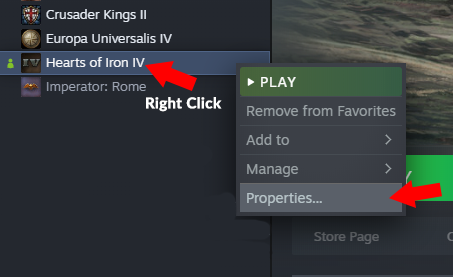
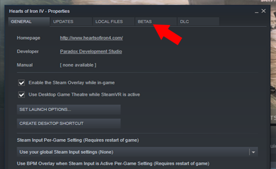
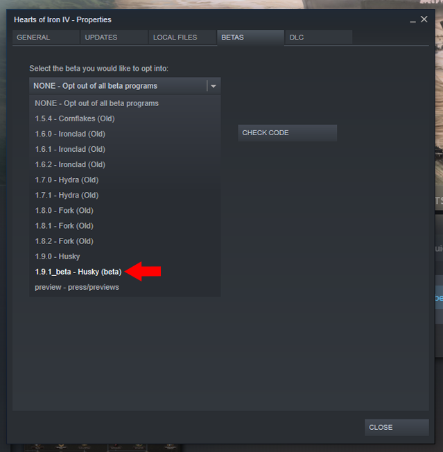

### ม็อดสำหรับเกมเวอร์ชัน open beta v1.9.2 [checksum: 595b] 
### ฐานข้อมูลจาก Mod v0.90.7 beta  
 

วิธีติดตั้ง
 1. #### *ใครที่ได้กด Subscribe/สมัครสมาชิก ม็อดตัวหลักอยู่( Steam Workshop ) ให้ทำการกด unsubscribe ก่อน  
 2. #### *ใครที่ติดตั้งม็อดด้วยตนเองให้ลบโฟลเดอร์   "C:\Users\\{ชื่อผู้ใช้}\Documents\Paradox Interactive\Hearts of Iron IV\mod"  
 3. โหลดม็อดโดยกดปุ่มด้านขวาบน(ในหน้านี้) ตามภาพ 
    
 4. ติดตั้งด้วยตนเอง [ตัวอย่างจะอยู่ในคลิบนี้(การติดตั้งด้วยตนเองจะอยู่ส่วนที่2)](https://youtu.be/c_Kt8elBl3Y)
 5. โหลดเกมตัว open beta ดังนี้ 
   5.1 เข้า Steam -> Library 
   5.2 คลิกขวาที่เกม จะมี Context menu แล้วเลือก Properties...
      
   5.3 คลิก Tab BETAS
      
   5.4 คลิก Drop-down เพื่อเลือกเกมเวอร์ชัน x.x.x_beta - codename (beta) ในที่นี้ให้เลือกเป็นเวอร์ชัน beta v1.9.2
      
   5.5 รอ Steam โหลดและติดตั้งแพตช์จนเสร็จ
 6. เข้าเกม
