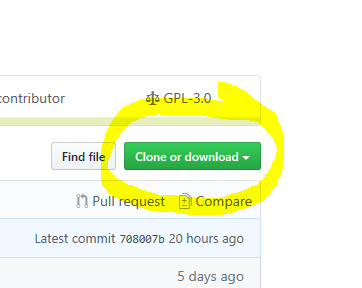
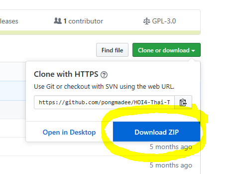

### ม็อดสำหรับเกมเวอร์ชัน open beta v1.9.1 [checksum: f08e] 
### ฐานข้อมูลจาก Mod v0.90.2 alpha [checksum: n/a]  
 

วิธีติดตั้ง
 1. #### *ใครที่ได้กด Subscribe/สมัครสมาชิก ม็อดตัวหลักอยู่( Steam Workshop ) ให้ทำการกด unsubscribe ก่อน  
 2. #### *ใครที่ติดตั้งม็อดด้วยตนเองให้ลบโฟลเดอร์   "C:\Users\\{ชื่อผู้ใช้}\Documents\Paradox Interactive\Hearts of Iron IV\mod"  
 3. โหลดม็อดโดยกดปุ่มด้านขวาบน(ในหน้านี้) ตามภาพ  
  
 4. ติดตั้งด้วยตนเอง [ตัวอย่างจะอยู่ในคลิบนี้(การติดตั้งด้วยตนเองจะอยู่ส่วนที่2)](https://youtu.be/c_Kt8elBl3Y)
 5. โหลดเกมตัว open beta [ตามลิงค์นี้](https://forum.paradoxplaza.com/forum/index.php?threads/hoi4-1-9-1-beta-patch-available-now.1348928/)
 6. เข้าเกม
