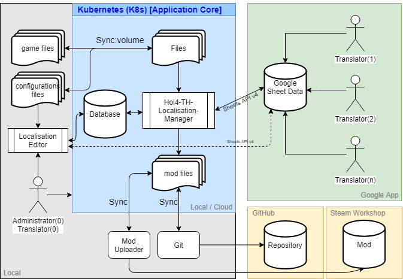

# HOI4 Thai Translation MOD   
Hearts of Iron IV - Thai Translation MOD

#### :floppy_disk: [Download (Steam Workshop)](https://steamcommunity.com/sharedfiles/filedetails/?id=1729555797)
#### :floppy_disk: [Download (GitHub)](https://github.com/pongmadee/HOI4-Thai-Translation-MOD/releases) 
#### :page_with_curl: [วิธีติดตั้งม็อด](https://youtu.be/c_Kt8elBl3Y)

### INFORMATIONS - ข้อมูล
 :heavy_check_mark: รองรับถึงเกมเวอร์ชัน 1.9.3 "Husky"  
 :heavy_check_mark: รองรับโหมด Ironman  
 :heavy_check_mark: รองรับรางวัลความสำเร็จ Achievement  
 :heavy_check_mark: รองรับโหมด Multiplayer  
 :heavy_check_mark: เซฟเกมของม็อดทุกเวอร์ชั่นสามารถใช้ได้กับเซฟเกมเก่าได้ไม่มีปัญหา(ยกเว้นตัวเกมหลักมีการอัปเดตเวอร์ชัน(หลัก)เช่น 1.8 -> 1.9)  
 :no_entry_sign: ไม่สามารถพิมพ์ชื่อประเทศหรือชื่อฝ่ายที่เป็นภาษาไทยในฟังก์ชันค้นหาได้ (พิมพ์ได้แต่ไม่เจอ)  

### FEATURES - คุณลักษณะเด่น
- สามารถพิมพ์ไทยได้ ส่วนที่สามารถแก้ไขและบันทึกเป็นภาษาไทย ได้แก่ ชื่อกองพล, ชื่อกองทัพ, ชื่อหมู่กองทัพ, ยุทธบริเวณ, ชื่อเรือรบ, กองเรือเฉพาะกิจ, แม่แบบกองพล, ชื่อรุ่นโมเดลอาวุธ, ชื่อหน่วยสืบราชการลับ/หน่วยข่าวกรอง/องค์กรใต้ดิน/กลุ่มต่อต้าน, รหัสประจำตัวสายลับ และ อื่นๆ  

- สามารถใช้ภาษาไทยในการค้นหายุทธศาสตร์ได้  
    

### OFFICIAL SUBMODS - ม็อดย่อย
- [ขบวนการเสรีไทย - Free Thai Movement](https://steamcommunity.com/sharedfiles/filedetails/?id=2039271466) เมื่อเลือกเล่นเป็นสยาม จะสามารถใช้ตราสัญลักษณ์เสรีไทย(ขบวนการเสรีไทย) ในการตั้งหน่วยข่าวกรองได้  
    

### PROGRESS & ROADMAP - ความคืบหน้า
* [แผนงานและรายละเอียดความคืบหน้าทั้งหมด](https://trello.com/b/JUbreJWk/hoi4-thai-translation-mod)
* อัปเดตม็อดอย่างน้อยสัปดาห์ละ 1 - 2 ครั้งครับ

### TRANSLATION - การแปล
* [คำศัพท์ที่สำคัญเปรียบเทียบกับต้นฉบับภาษาอังกฤษ](https://github.com/pongmadee/HOI4-Thai-Translation-MOD/blob/develop/docs/TranslationTable.md)

### FAQ - รวมถามตอบปัญหา
* [คลิบวิธีดาวน์โหลดและติดตั้งม็อดแบบละเอียด](https://youtu.be/c_Kt8elBl3Y)
* [วิธีดาวน์โหลดม็อดและเปิดม็อด (Steam Workshop)](https://github.com/pongmadee/HOI4-Thai-Translation-MOD/blob/develop/docs/EnabledMod.md)
* [ถ้าม็อดขึ้นเครื่องหมายตกใจ](https://github.com/pongmadee/HOI4-Thai-Translation-MOD/blob/develop/docs/Solution1.md)

### DONATIONS - สนับสนุนยุทธปัจจัยผู้พัฒนา
* [เล่นแล้วชอบ ถูกใจ สามารถสนับสนุนยุทธปัจจัยค่าไฟ,ค่ามาม่าผู้พัฒนาได้ครับผ่านทาง Patreon ขอบคุณครับ](https://www.patreon.com/hoi4thai) :ramen:

### TOOLS - เครื่องมือ
 * [Hoi4-TH-Localisation-Manager v1.0 (ปัจจุบันใช้ตัวนี้อยู่)](https://github.com/pongmadee/HOI4-Thai-Translation-MOD/blob/develop/docs/DevDiary-Hoi4-TH-Localisation-Manager_V1.md)
 * [Hoi4-TH-Localisation-Manager v2.0 (กําลังพัฒนา)](https://github.com/pongmadee/HOI4-Thai-Translation-MOD/blob/develop/docs/DevDiary-Hoi4-TH-Localisation-Manager_V2.md)
 * [Localisation-Editor (กําลังพัฒนาและใช้งาน)](https://github.com/pongmadee/HOI4-Thai-Translation-MOD/blob/develop/docs/DevDiary-Localisation-Editor.md)    

### TEAM WORK - ทีมงาน
- Translator - ผู้ช่วยแปล
  - Jittawat Dongparee
  - Parintorl Maneewan
  - Phuphu Alisa Owari
  - Pirunmate Gwangsawat
  - Pun Tantakosai
  - Sakkawat Prachumrear
  - Santawat Denmetharat
  - Suzume Tachibana
  - Tle Tanapon
  - ภัทรพล สมเหมาะ
  - Thanatad Gladthed
  - Nattakit Hosapsin
  - ชวิศ พิภพโสภณชัย

- Programmer - โปรแกรมเมอร์
  - [Pongmadee](https://github.com/pongmadee)

- Computer graphics - คอมพิวเตอร์กราฟิก
  - Pongmadee

ขอขอบคุณกลุ่มใน Facebook [Thai Paradox RTS](https://web.facebook.com/groups/582871258426509)

### License
Copyright © 2019, Pongmadee. Released under the [GPL-3.0 License](https://github.com/pongmadee/HOI4-Thai-Translation-MOD/blob/develop/LICENSE).
