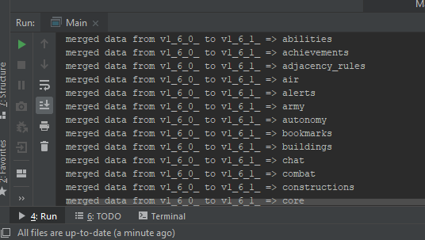

## จุดเริ่มต้นและที่มาของ Project นี้

 ตอนแรกผมเข้าไปหาม็อดใน Steam Workshop มาเล่น บังเอิญเห็นม็อดภาษาญี่ปุ่น,จีน ผมก็เลยไปหาว่ามีไทยหรือเปล่า ก็ไปเจอผลงานของท่าน LanguGamesth ก็เลยเอามาลองเล่น ปรากฏว่ารองรับถึงเวอร์ชั่น 1.4.2 (ปัจจุบัน 1.6+) เข้าไปดูใน page คิดว่าเขาน่าจะหยุดพัฒนาไปแล้ว

 ผมคิดว่าที่เขาไม่พัฒนาต่อปัญหาน่าจะเป็นเพราะ เมื่อเกมมีการอัปเดตเวอร์ชั่นใหม่ผู้พัฒนาม็อดจะต้องแก้ไฟล์ที่แปลให้เข้ากันได้กับเกมเวอร์ชั่นใหม่โดยเปรียบเทียบกันที่ละบรรทัดกับไฟล์ไฟล์เวอร์ชั่นเก่า copy & paste ซึ่งใช้เวลาตรวจสอบมาก

##### ดังนั้นเพื่อแก้ปัญหาดังกล่าวผมจึงได้เขียนโปรแกรมตัวหนึ่งขึ้นมาทำการตรวจสอบและรวมผสาน(merge)ไฟล์เวอร์ชั่นเก่าและใหม่ แล้วเก็บทุกอย่างไว้ที่ฐานข้อมูล เพื่อสะดวกในการสืบค้นและแก้ไขคำผิด สามารถดึงข้อมูลไปสร้างไฟล์ม็อด ทำให้ระยะเวลาที่จะทำให้ม็อดทันสมัยทำได้เร็วมากขึ้น ส่วนการแปลจะแปลเพียงครั้งเดียวลงบนฐานข้อมูลโดยตรง หรือนำเข้ามาจากงานที่ทำกับทีมงานที่อยู่บน Google Sheet 

## เครื่องมือที่ใช้
 - Java OpenJDK 12 (ภาษาโปรแกรม)
 - Mysql (ฐานข้อมูล)
 - IntelliJ IDEA (Java IDE)

## ลักษณะรูปแบบการสั่งงาน
จะเป็นการสั่งงานผ่าน console app (command line)

## หลักการทำงานโปรแกรมเวอร์ชั่น 1.0

## หลักการทำงานโปรแกรมเวอร์ชั่น 1.0.1
เพิ่มในส่วนที่เกี่ยวกับ GitHub 

ฐานข้อมูลใน Google Sheet และ ฐานข้อมูลออฟไลน์
 
