## จุดเริ่มต้นและที่มาของ Project นี้

 ตอนแรกผมเข้าไปหาม็อดใน Steam Workshop มาเล่น บังเอิญเห็นม็อดภาษาญี่ปุ่น,จีน ผมก็เลยไปหาว่ามีไทยหรือเปล่า ก็ไปเจอผลงานของท่าน LanguGamesth ก็เลยเอามาลองเล่น ปรากฏว่ารองรับถึงเวอร์ชั่น 1.4.2 (ปัจจุบัน 1.6+) เข้าไปดูใน page คิดว่าเขาน่าจะหยุดพัฒนาไปแล้ว

 ผมคิดว่าที่เขาไม่พัฒนาต่อปัญหาน่าจะเป็นเพราะ เมื่อเกมมีการอัปเดตเวอร์ชั่นใหม่ผู้พัฒนาม็อดจะต้องแก้ไฟล์ที่แปลให้เข้ากันได้กับเกมเวอร์ชั่นใหม่โดยเปรียบเทียบกันที่ละบรรทัดกับไฟล์ไฟล์เวอร์ชั่นเก่าแล้วคัดลอกจากของเก่ามาไว้ของใหม่ซึ่งใช้เวลาตรวจสอบนานมาก แถมบางทีจะมีข้อมูลเพิ่มเข้ามาใหม่จึงยากที่จะทำให้ม็อดทันสมัยได้เร็ว

#### ดังนั้นเพื่อแก้ปัญหาดังกล่าวผมจึงได้เขียนโปรแกรมตัวหนึ่งขึ้นมา(Hoi4-TH-Localisation-Manager)ทำการตรวจสอบและรวมผสาน(merge)ไฟล์เวอร์ชั่นเก่าและใหม่ แล้วเก็บทุกอย่างไว้ที่ฐานข้อมูล เพื่อสะดวกในการสืบค้นและแก้ไขคำผิด สามารถดึงข้อมูลไปสร้างไฟล์ม็อด ทำให้ระยะเวลาที่จะทำให้ม็อดทันสมัยทำได้เร็วมากขึ้น ส่วนการแปลจะแปลเพียงครั้งเดียวลงบนฐานข้อมูลโดยตรง หรือดึงมาจากงานที่ทำกับทีมงานที่อยู่บน Google Sheet 

## ความรู้ที่ใช้
 - Compilers: Principles, Techniques, and Tools (Textbook)
 - Compiler Construction (วิชาเขียนคอมไพเลอร์ สมัยเรียน ป.ตรี จำได้ว่าตอนนั้นผมใช้ C/C++ เขียนคอมไพเลอร์ pointer สนุกสนาน..555 )
 - Java (พื้นฐาน)
 - SQL (พื้นฐาน)
 - Google Sheets API v4
 - Docker -> Kubernetes (K8s)
 - Excel -> Google sheet (พื้นฐาน Functions และ formulas)
 
 

## เครื่องมือที่ใช้
 - Java OpenJDK 12 (ภาษาโปรแกรม)
 - Mysql (ฐานข้อมูล)
 - IntelliJ IDEA (Java IDE)
 - Docker Desktop (Kubernetes - K8s)

## ผังการทำงานโปรแกรมเวอร์ชั่น 1.0
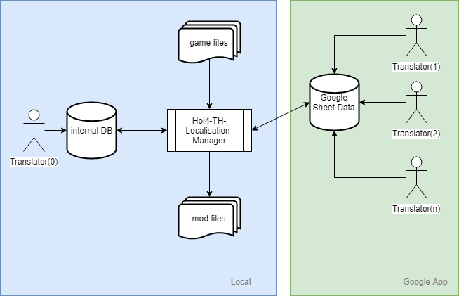

## ผังการทำงานโปรแกรมเวอร์ชั่น 1.0.1
เพิ่มในส่วนที่เกี่ยวกับ GitHub และย้ายฐานข้อมูลและโปรแกรมไปไว้ที่ Docker 
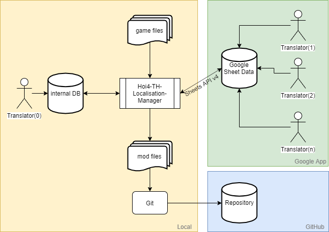

## ผังการทำงานโปรแกรมเวอร์ชั่น 1.0.2
เพิ่มในส่วนที่เกี่ยวกับ Kubernetes (K8s) และย้ายฐานข้อมูลและโปรแกรมไปไว้ที่ Kubernetes แทนแบบเดิมที่รันบน Docker  
### แล้วทำไมต้องเปลี่ยน? ทั้งๆที่ Docker ก็ทำได้อยู่แล้ว??
เหตุผลคือ 

- 1.ต้องการศึกษาการทำงานของ Kubernetes ว่าทำงานอย่างไร เพราะ Kubernetes จะเป็นตัวจัดการ Container อีกทีและเป็นที่นิยมในท้องตลาดด้านการจัดการ Container หลังจากสงครามคอนเทนเนอร์เริ่มสงบลง

- 2.ผมขี้เกียจรันคำสั่ง Docker run ทุกครั้งที่จะเปิดใช้งาน App (ตั้งแต่ย้ายมา Kubernetes ชีวิตง่ายขึ้นมาก ถ้าศึกษาจนเข้าใจแล้วนะ มันจะทำงานให้เองอัตโนมัติเราไม่ต้องไปยุ่งมันมากแตกต่างจาก Docker ที่เราต้องจัดการพิมพ์คำสั่งเอง มีความซับซ้อนมากกว่า Docker อยู่พอดูนะ แต่ก็ไม่ยากเกินจะศึกษา)

- 3.ปูทางไปสู่ v2.0 เพราะในเวอร์ชันถัดไป โปรแกรมจะรันบนคลาวด์เลยมาชิมลางดูก่อน

- 4.ฝึกเป็นทักษะติดตัวไว้เพราะโลกต่อไปนี้ ระบบต่างๆจะรันบนคลาวด์

- 5.สนุกและท้าทายเหมือนเล่นเกมเลย เมื่อแก้บักผ่านก็เหมือนเราได้ Achievement (เป็นความบ้าส่วนตัวของผมเองครับ)
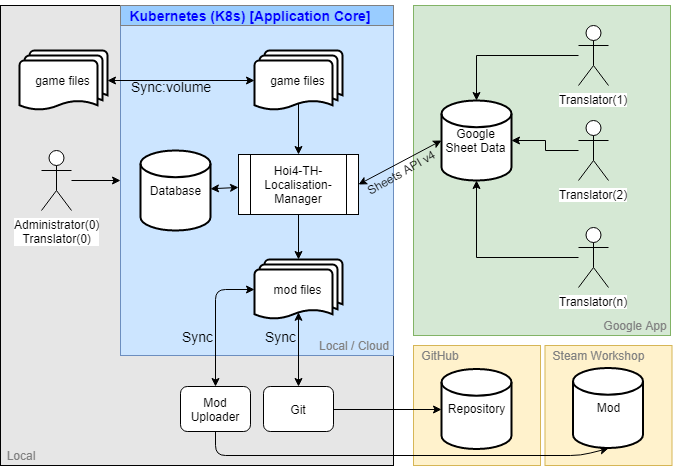

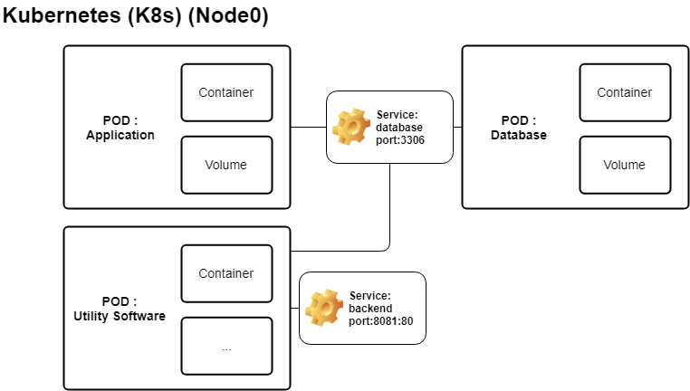

ฐานข้อมูลใน Google Sheet และ ฐานข้อมูลออฟไลน์ 
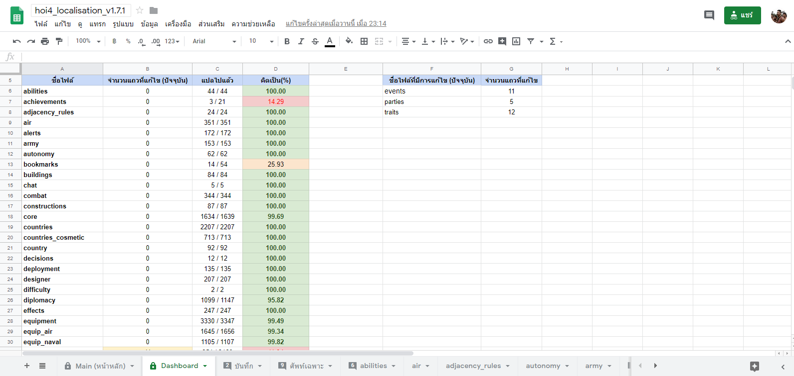 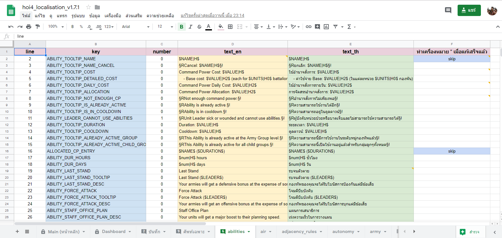 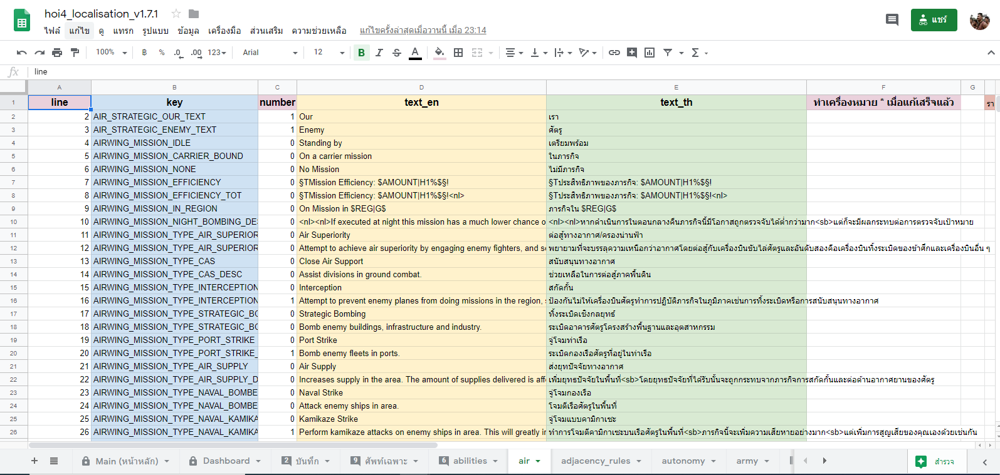 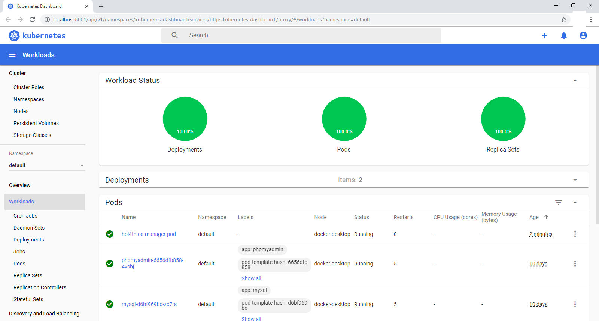 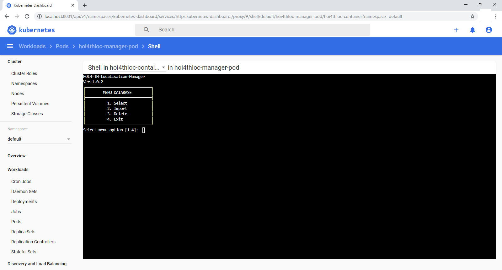 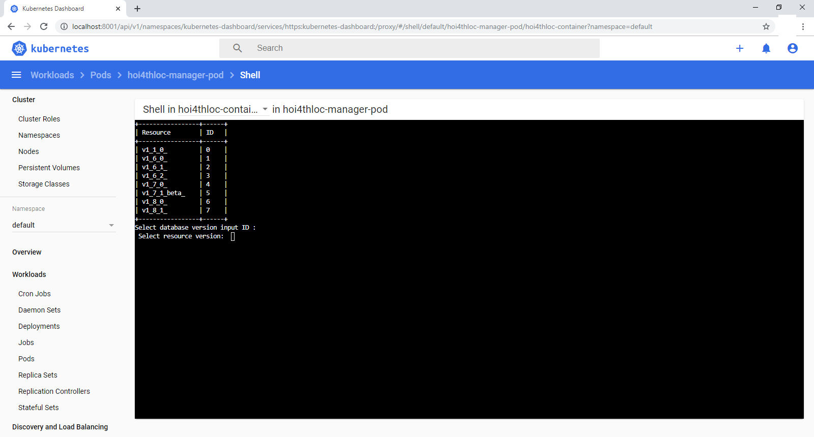 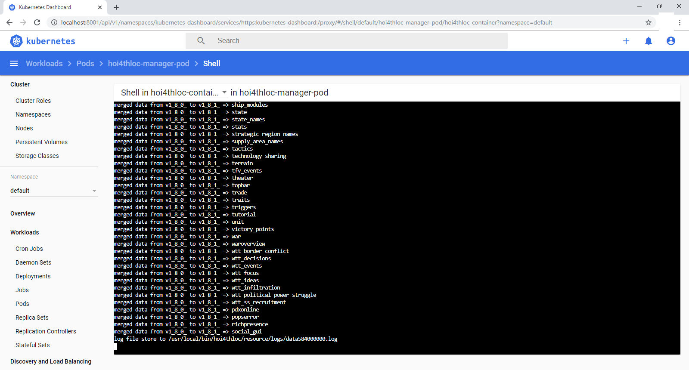 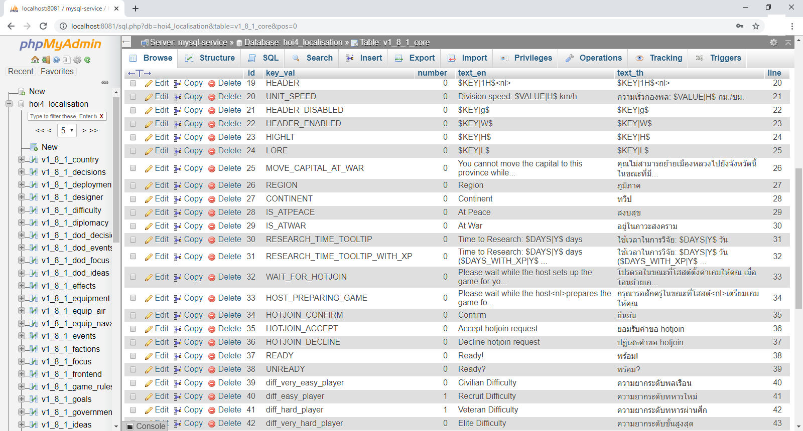

## ลักษณะรูปแบบการสั่งงาน
จะเป็นการสั่งงานผ่าน console app (command line)

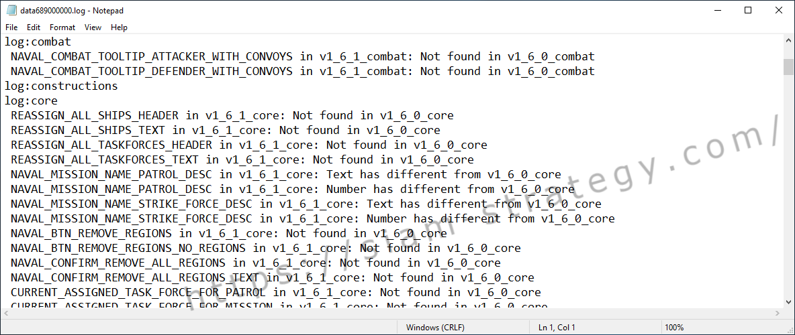

## เอกสารอ้างอิง
- https://docs.oracle.com/javase/tutorial/
- https://www.w3schools.com/java/
- https://developers.google.com/sheets/api/quickstart/java
- https://support.office.com/en-us/article/abf52a64-560c-4f24-909f-cc549b1cb3a3
- https://support.google.com/docs/topic/1361471?hl=en
- https://docs.docker.com/get-started/
- https://kubernetes.io/
- https://www.blognone.com/node/106492
