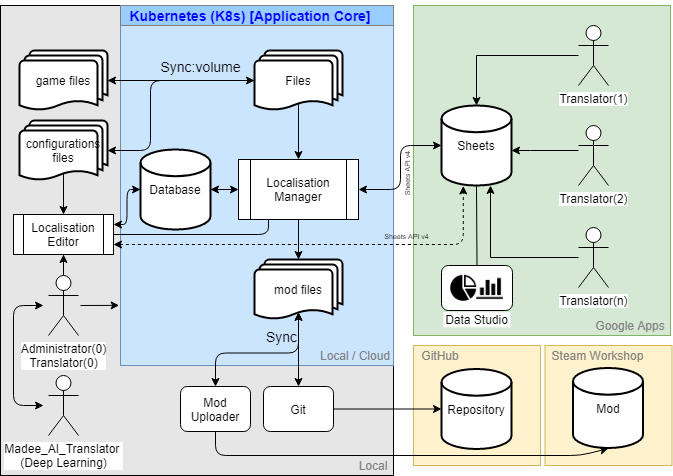

#### *บันทึกการพัฒนาแอปพลิเคชัน Hoi4-TH-Localisation-Manager V1


## จุดเริ่มต้นและที่มาของ Project นี้

 ตอนแรกผมเข้าไปหาม็อดใน Steam Workshop มาเล่น บังเอิญเห็นม็อดภาษาญี่ปุ่น,จีน ผมก็เลยไปหาว่ามีไทยหรือเปล่า ก็ไปเจอผลงานของท่าน LanguGamesth ก็เลยเอามาลองเล่น ปรากฏว่ารองรับถึงเวอร์ชั่น 1.4.2 (ปัจจุบัน 1.6+) เข้าไปดูใน page คิดว่าเขาน่าจะหยุดพัฒนาไปแล้ว

 ผมคิดว่าที่เขาไม่พัฒนาต่อปัญหาน่าจะเป็นเพราะ เมื่อเกมมีการอัปเดตเวอร์ชั่นใหม่ผู้พัฒนาม็อดจะต้องแก้ไฟล์ที่แปลให้เข้ากันได้กับเกมเวอร์ชั่นใหม่โดยเปรียบเทียบกันที่ละบรรทัดกับไฟล์ไฟล์เวอร์ชั่นเก่าแล้วคัดลอกจากของเก่ามาไว้ของใหม่ซึ่งใช้เวลาตรวจสอบนานมาก แถมบางทีจะมีข้อมูลเพิ่มเข้ามาใหม่จึงยากที่จะทำให้ม็อดทันสมัยได้เร็ว

#### ดังนั้นเพื่อแก้ปัญหาดังกล่าวผมจึงได้เขียนโปรแกรมตัวหนึ่งขึ้นมา( MergeVersion ซึ่งต่อมาใช้ชื่อ Hoi4-TH-Localisation-Manager )ทำการตรวจสอบและรวมผสาน(merge)ไฟล์เวอร์ชั่นเก่าและใหม่ แล้วเก็บทุกอย่างไว้ที่ฐานข้อมูล เพื่อสะดวกในการสืบค้นและแก้ไขคำผิด สามารถดึงข้อมูลไปสร้างไฟล์ม็อด ทำให้ระยะเวลาที่จะทำให้ม็อดทันสมัยทำได้เร็วมากขึ้น ส่วนการแปลจะแปลเพียงครั้งเดียวลงบนฐานข้อมูลโดยตรง หรือดึงมาจากงานที่ทำกับทีมงานที่อยู่บน Google Sheet 

## ความรู้ที่ใช้
 - Compilers: Principles, Techniques, and Tools (Textbook)
 - Compiler Construction (วิชาเขียนคอมไพเลอร์ สมัยเรียน ป.ตรี จำได้ว่าตอนนั้นผมใช้ C/C++ เขียนคอมไพเลอร์ pointer สนุกสนาน..555 )
 - Java (พื้นฐาน)
 - SQL (พื้นฐาน)
 - Google Sheets API v4
 - Docker -> Kubernetes (K8s) [v1.0.1+]
 - Excel -> Google sheet (พื้นฐาน Functions และ formulas)
 
 

## เครื่องมือที่ใช้
 - Java OpenJDK 12 (ภาษาโปรแกรม)
 - Mysql (ฐานข้อมูล)
 - IntelliJ IDEA (Java IDE)
 - Docker Desktop (Kubernetes - K8s) [v1.0.2]

## ผังการทำงานโปรแกรมเวอร์ชั่น 1.0


## ผังการทำงานโปรแกรมเวอร์ชั่น 1.0.1
เพิ่มในส่วนที่เกี่ยวกับ GitHub และย้ายฐานข้อมูลและโปรแกรมไปไว้ที่ Docker</br>


## ผังการทำงานโปรแกรมเวอร์ชั่น 1.0.2
เพิ่มในส่วนที่เกี่ยวกับ Kubernetes (K8s) และย้ายฐานข้อมูลและโปรแกรมไปไว้ที่ Kubernetes แทนแบบเดิมที่รันบน Docker </br>
### แล้วทำไมต้องเปลี่ยน? ทั้งๆที่ Docker ก็ทำได้อยู่แล้ว??
เหตุผลคือ 

- 1.ต้องการศึกษาการทำงานของ Kubernetes ว่าทำงานอย่างไร เพราะ Kubernetes จะเป็นตัวจัดการ Container อีกทีและเป็นที่นิยมในท้องตลาดด้านการจัดการ Container หลังจากสงครามคอนเทนเนอร์เริ่มสงบลง

- 2.ผมขี้เกียจรันคำสั่ง Docker run ทุกครั้งที่จะเปิดใช้งาน App (ตั้งแต่ย้ายมา Kubernetes ชีวิตง่ายขึ้นมาก ถ้าศึกษาจนเข้าใจแล้วนะ มันจะทำงานให้เองอัตโนมัติเราไม่ต้องไปยุ่งมันมากแตกต่างจาก Docker ที่เราต้องจัดการพิมพ์คำสั่งเอง มีความซับซ้อนมากกว่า Docker อยู่พอดูนะ แต่ก็ไม่ยากเกินจะศึกษา)

- 3.ปูทางไปสู่ v2.0 เพราะในเวอร์ชันถัดไป โปรแกรมจะรันบนคลาวด์เลยมาชิมลางดูก่อน

- 4.ฝึกเป็นทักษะติดตัวไว้เพราะโลกต่อไปนี้ ระบบต่างๆจะรันบนคลาวด์ ซึ่งโปรแกรมนี้สามารถนำไปรันบน Google Cloud , AWS , Microsoft Azure และ DigitalOcean ได้

- 5.สนุกและท้าทายเหมือนเล่นเกมเลย เมื่อแก้บักผ่านก็เหมือนเราได้ Achievement (เป็นความบ้าส่วนตัวของผมเองครับ)


ฐานข้อมูลใน Google Sheet และ ฐานข้อมูลออฟไลน์/คลาวด์บน K8s Cluster</br>
     

## ผังการทำงานโปรแกรมเวอร์ชัน 1.0.3 (JSON feature)
- 1.เพิ่มในส่วนที่เกี่ยวกับการตั้งค่า Configuration คือจะแยกในส่วนนี้ออกมาเป็นไฟล์ text (*.Json)ภายนอกแล้วโหลดตอนเปิดโปรแกรม เนื่องจากโดยปกติเวลาม็อดขึ้นเวอร์ชั่นใหม่จะต้องแก้ code ใหม่และทำการ compile โปรแกรมใหม่ทุกครั้ง </br>
- 2.สามารถเพิ่มข้อมูลใหม่ผ่านไฟล์ json ได้</br>
ตัวอย่างไฟล์ config.json
```yaml
{
  "APP_VERSION": "1.0.3",
  "MOD_VERSION": "0.89.8",
  "MOD_SUPPORTED_GAME_VERSION": "1.8.1",
  "extra_localisations": [
    {
      "key": "MOD_TEST1",
      "number": "0",
      "text": "dummy1"
    },
    {
      "key": "MOD_TEST2",
      "number": "0",
      "text": "dummy2"
    }
  ]
}
```


## ปรับปรุงแก้ไขโปรแกรมเวอร์ชัน 1.0.4 (Hotfix)
แก้บัคและเพิ่มประสิทธิภาพของ Lexical Analyzer </br>

## ปรับปรุงแก้ไขโปรแกรมเวอร์ชัน 1.0.5
เพิ่มรูปแบบพื้นฐาน (basic format) </br>

## ปรับปรุงแก้ไขโปรแกรมเวอร์ชัน 1.0.6 (Flags)
- 1.เพิ่ม field 'flags' เพื่อกำหนดสถานะของ records นั้นๆ </br>
- 2.ย้ายข้อมูล Configuration ออกมายัง config.json โดยสมบูรณ์ </br>
- 3.สามารถ Up/Download ข้อมูลใน spreadsheet ทั้งแบบกแยกและแบบทั้งหมดได้โดยสมบูรณ์ </br>

## ปรับปรุงแก้ไขโปรแกรมเวอร์ชั่น 1.1.0 (Quick Command/Command-Line Arguments)
รองรับการสั่งงานผ่าน Terminal/Command-Line ด้วยคำสั่งเพียงคำสั่งเดียว เช่น
 ```console
me@console:~$ kubectl exec -it hoi4thloc-manager-pod -- sh -c "java -jar hoi4-th-localisation-manager.jar build hoi4.config.v1.9.3.env-k8s.json"
me@console:~$ java -jar hoi4-th-localisation-manager.jar build hoi4.config.v1.9.3.env-win.json
```


## ส่วนขยายเพิ่มเติม 
- [Localisation-Editor (โปรแกรมแก้ไข text)](https://github.com/pongmadee/HOI4-Thai-Translation-MOD/blob/develop/docs/DevDiary-Localisation-Editor.md)</br>
- [MadeeAI-Translator (ปัญญาประดิษฐ์ช่วยแปล)](https://github.com/pongmadee/HOI4-Thai-Translation-MOD/blob/develop/docs/DevDiary-Madee-AI-Translator.md)</br>

## ลักษณะรูปแบบการสั่งงาน
    

## เอกสารอ้างอิง
- https://docs.oracle.com/javase/tutorial/
- https://www.w3schools.com/java/
- https://developers.google.com/sheets/api/quickstart/java
- https://support.office.com/en-us/article/abf52a64-560c-4f24-909f-cc549b1cb3a3
- https://support.google.com/docs/topic/1361471?hl=en
- https://docs.docker.com/get-started/
- https://kubernetes.io/
- https://www.blognone.com/node/106492
