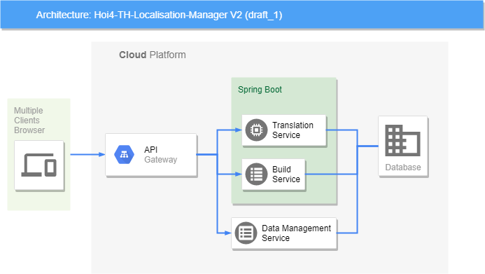

#### *บันทึกการพัฒนาแอปพลิเคชัน Hoi4-TH-Localisation-Manager V2

## จุดเริ่มต้นและที่มาของ Project นี้

1. เปลี่ยนสถาปัตยกรรมของโปรแกรมจาก Monolith เป็น Microservice  
2. เพิ่มระบบรักษาความปลอดภัย จำกัดสิทธิในการเข้าใช้ข้อมูลหรือระบบ Authentication & Authorization  
3. เนื่องจากข้อจำกัดของเวอร์ชันแรกซึ่งจะมีเพียงส่วนที่การตรวจสอบและคอมไพล์โค้ดม็อด แต่ยังขาดเครื่องมือที่จะทำให้ผู้แปลทำงานง่ายขึ้น เช่น ตรวจสอบตัวแปรที่แปลเสร็จกับต้นฉบับว่าตรงกันหรือไม่ การทำไฮไลท์ตัวอักษร ปรับขนาดตัวอักษรให้ดูง่ายขึ้น ขยายช่องแสดงผลตัวอักษร ...อื่นๆ ก็เลยอยากเพิ่มในส่วนนี้  
4. อยากเพิ่มการอภิปรายในกลุ่มของผู้แปล เช่นเมื่อแปลเสร็จหนึ่ง key ผู้แปลคนอื่นก็จะสามารถให้คะแนนการแปลของเราหรือแนะนำคำศัพท์ที่เหมาะสมได้ เวลาสร้างไฟล์ม็อด โปรแกรมก็จะเลือก key ของคนที่ได้คะแนนสูงสุดไปสร้างม็อด ซึ่งจะเรียกว่าเป็นแอพพลิเคชั่นแพลตฟอร์ม( Application Platform ) เช่นเดียวกับ wikipedia ,shopee ,lazada หรือ facebook เป็นต้น  
5. อัปเดตตัว Lexical Analyzer  

สถาปัตยกรรม Microservice จะแบ่งการทำงานเป็นหลายส่วน ประกอบไปด้วย  
1. ส่วนการแปลและอภิปราย Translation Service  
2. ส่วนในการสร้างม็อด Build Service  

## เครื่องมือที่ใช้
 - Spring Boot
 - จาก Hoi4-TH-Localisation-Manager (V1)
