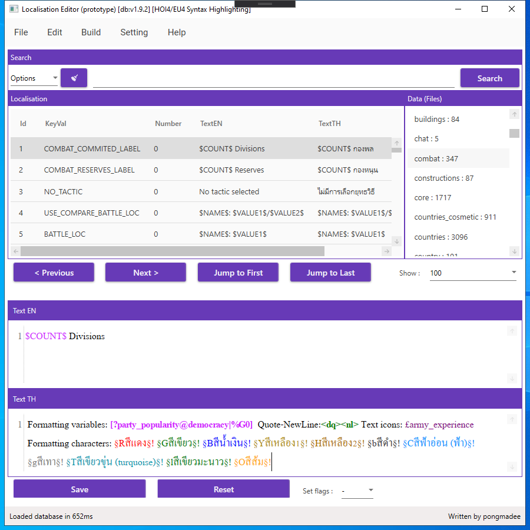
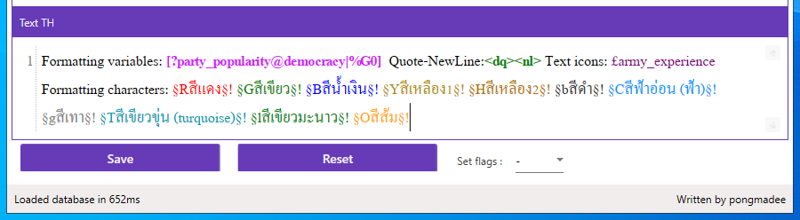
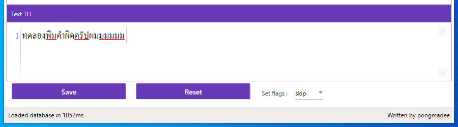
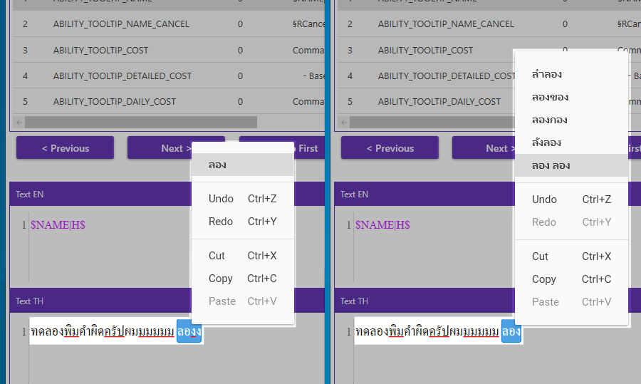
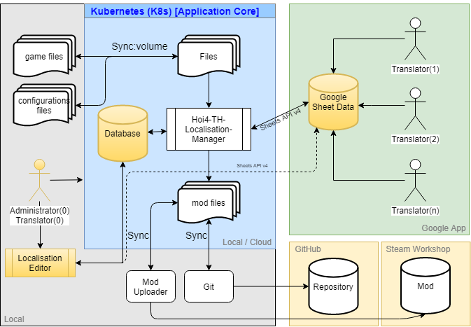
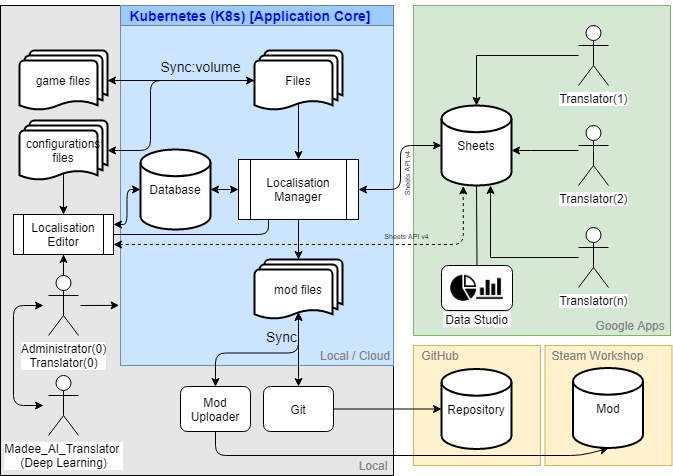
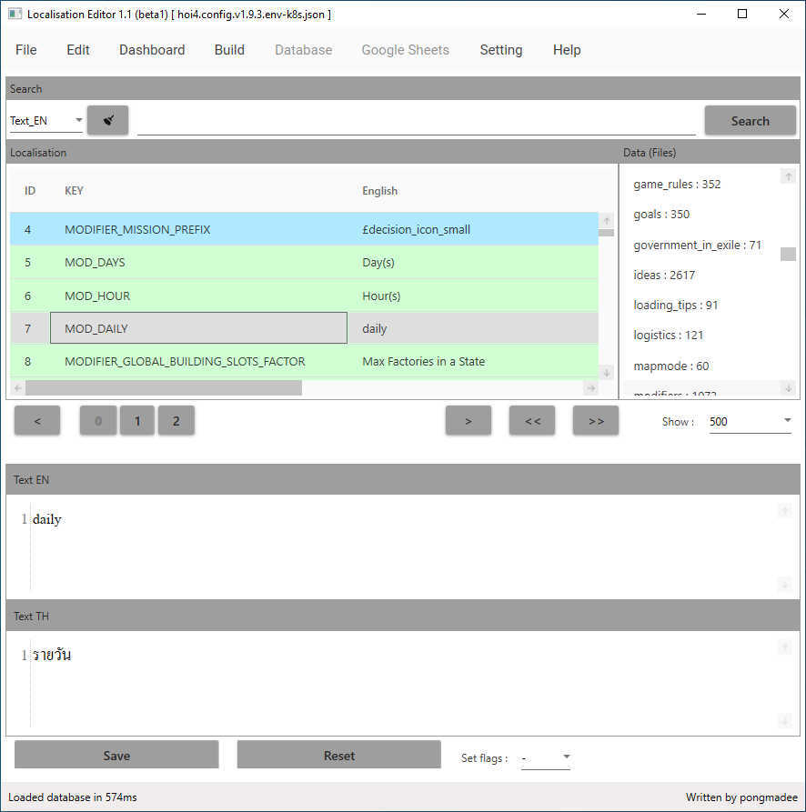

#### *บันทึกการพัฒนาแอปพลิเคชัน Localisation Editor

## จุดเริ่มต้นและที่มาของ Project นี้

ช่วงเวลาที่ผ่านมา สิ่งสำคัญที่ยังขาดสำหรับโปรเจคนี้คือตัวแก้ไขข้อความ (Text Editor) สำหรับโครงงานนี้โดยเฉพาะ ซึ่งโดยปกติแล้วจะแก้ที่ฐานข้อมูลโดยตรง(ต้องเขียน SQL)หรือใช้โปรแกรมจัดการฐานข้อมูล ประกอบกับความต้องการระบบค้นหาคำในฐานข้อมูลแบบเฉพาะเจาะจง(ต้องเขียนใหม่ SQL ทุกครั้งที่ค้นหา) ส่วนในการใช้ Google Sheets มาช่วยแก้ไขก็เป็นส่วนที่ดี แต่อาจจะไม่เหมาะกับงานแก้ข้อความยาวๆได้ดีนักและยังพบปัญหาการพิมพ์ผิดอยู่บ่อยครั้ง(ผมเป็นอยู่บ่อยๆ555+) เวลาแก้ข้อความต้องระวังเรื่องตัวแปรที่แทรกในข้อความปกติเป็นอย่างมาก เพราะถ้าพลาดไปแก้ในส่วนที่เป็นตัวแปรอาจทำให้เกมแสดงผลผิดพลาดได้  

### สิ่งที่ยังขาดหายไปสรุปแจกแจงได้ดังนี้
1. ต้องการตัวแก้ไขข้อความ Text Editor สำหรับโครงงานนี้โดยเฉพาะ  
2. ต้องการระบบค้นหาคำในฐานข้อมูลแบบเฉพาะเจาะจง (ตัวอย่าง ค้นหาคำในฐานข้อมูลเกมเวอร์ชัน v1.9.0)  
3. การอํานวยความสะดวกในการแก้ไขข้อความ เช่น เน้นคำสำคัญให้เด่นขึ้น (ใช้ข้อความสี)  
4. ต้องการระบบตรวจสอบคำที่พิมพ์ผิด  

นี่จึงเป็นการดีที่เราจะสร้างตัวแก้ไขข้อความ (Localisation Editor) เพื่อแก้ปัญหาดังกล่าวและทำให้ระบบสมบูรณ์มากขึ้น 

## ฟังก์ชันหลักในโปรแกรม Localisation Editor
1. แก้ไขข้อความ  
2. ค้นหาข้อมูล  
3. เน้นคำสำคัญให้เด่นชัดขึ้น (Syntax Highlighting)  
4. ตรวจสอบคำพิมพ์ผิด (Spell Checking)  
5. ระบบแนะนำคำศัพท์ (Suggestions)  
6. ทำงานร่วมกับ Localisation-Manager ได้  
7. เชื่อมต่อกับฐานข้อมูลโดยตรง  
8. เชื่อมต่อกับ Google Sheets ได้  
9. สามารถเปลี่ยนขนาดตัวอักษรและชนิดตัวอักษรได้  

## Feature - เน้นคำสำคัญให้เด่นชัดขึ้น (Syntax Highlighting)
- เปลี่ยนขนาดตัวอักษรและชนิดตัวอักษรได้  
   

## Feature - ตรวจสอบคำพิมพ์ผิด (Spell Checking)
คำในพจนานุกรมภาษาไทยจาก
   
 - LEXiTRON โดย NECTEC สวทช.
 - คำภาษาไทยที่ไม่รู้จักจาก NECTEC สวทช.
 - libthai data
 - libreoffice
   

## Feature - แนะนำคำศัพท์ (Suggestions)
ระบบแนะนำคำศัพท์
   

## ผังการทำงาน
  

## ปรับปรุงแก้ไขโปรแกรมเวอร์ชัน 1.1 (Beta1)
- 1.สามารถสั่งงานโปรแกรม Localisation-Manager ได้โดยตรง  
- 2.รองรับการใช้คีย์ลัด (keyboard) เช่น 'Ctrl + s' คือการบันทึกข้อมูล, กดปุ่ม Enter เมื่ออยู่ในหน้าต่างถามตอบ (Yes-No Dialog) จะเป็นการตอบตกลง เช่นเดียวกับการใช้เมาส์คลิกที่ปุ่ม 'Yes' แต่ถ้ากด 'Esc' จะเป็นการยกเลิกหรือปิดหน้าต่าง Dialog ดังกล่าว 
- 3.เพิ่มหน้าสรุปจำนวนการแปล (Dashboard)  
- 4.เพิ่มเมนูคำสั่ง Build เมื่อกดปุ่มดังกล่าว โปรแกรมจะไปสั่งงาน Localisation-Manager ให้ทำการสร้างม็อด  
- 5.ทำ Highligh ใน DataGrid แถวที่แปลแล้วหรือเป็นไปตามค่า flag ในแถวนั้นๆ  
- 6.เพิ่มชุดปุ่มเลือกหน้าของ DataGrid  
  
  

## เครื่องมือที่ใช้
 - C# WPF (ภาษาโปรแกรม)
 - Design pattern : MVVM
 - Visual Studio Community 2019

 ## Library
 - Material Design In XAML Toolkit
 - Google APIs (Sheets)
 - Hunspell
 - AvalonEdit

 ## เอกสารอ้างอิง
 - http://lexitron.nectec.or.th/
 - http://materialdesigninxaml.net/
 - http://hunspell.github.io/
 - https://github.com/icsharpcode/AvalonEdit
 - https://developers.google.com/sheets/api
 - https://hoi4.paradoxwikis.com/Localisation
 - https://eu4.paradoxwikis.com/Localisation