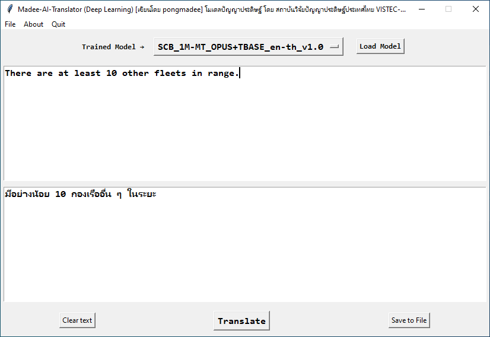
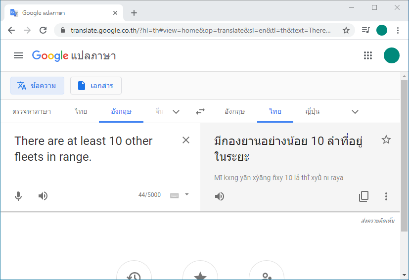
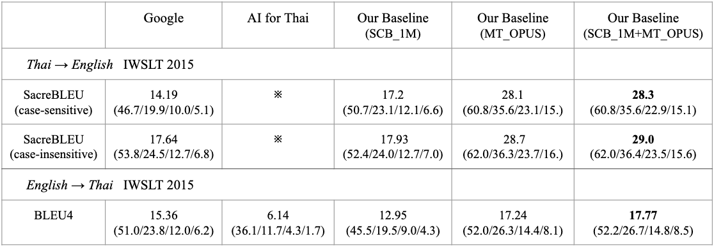
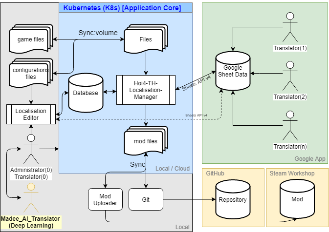

#### *บันทึกการพัฒนาแอพพลิเคชั่น Madee Artificial Intelligence Translator (Deep Learning)

### ตัวอย่างโปรแกรมแอพพลิเคชั่น

### ตัวอย่างการแปลบน Google Translate API

## จุดเริ่มต้นและที่มาของ Project นี้

อยากลองทดสอบหรือพิสูจน์สมมติฐานว่าคะแนนการทดสอบโมเดลปัญญาประดิษฐ์จะเป็นไปตามที่อ้างอิงหรือไม่ หากเป็นไปตามนั้นก็จะใช้เป็นผู้ช่วยแปลต่อไป โดยโมเดลปัญญาประดิษฐ์เป็นของสถาบันวิจัยปัญญาประดิษฐ์ประเทศไทย VISTEC-depa  

## เป้าหมายของ Project นี้
 - พิสูจน์สมมติฐานว่าคะแนนการทดสอบโมเดลปัญญาประดิษฐ์จะเป็นไปตามที่อ้างอิงหรือไม่
 - เป็นผู้ช่วยในการแปล
 - เพิ่มความเร็วในการแปล
 - ช่วยเปิดทางเพื่อนำงานนี้หรือโมเดลไปประยุกต์ใช้กับงานอื่นๆของผมในอนาคต
 - สนับสนุนผลงานนักวิจัยไทย

## โมเดลที่ใช้มีดังนี้ (สถาบันวิจัยปัญญาประดิษฐ์ประเทศไทย)
 - MT_OPUS+TBASE_en-th_v1.0
 - SCB_1M+TBASE_en-th_v1.0
 - SCB_1M-MT_OPUS+TBASE_en-th_v1.0

## ผลคะแนนการทดสอบ(อ้างอิง)

## ผังการทำงาน
  

## เครื่องมือที่ใช้
 - Python (ภาษาโปรแกรม)
 - Design pattern : n/a
 - PyCharm

 ## Library
 - Tkinter (GUI)
 - PyTorch/fairseq (Facebook AI Research Sequence-to-Sequence Toolkit)

 ## เอกสารอ้างอิง
 - https://github.com/pytorch/fairseq
 - https://github.com/vistec-AI/
 - https://www.vistec.ac.th/
 - https://www.depa.or.th/