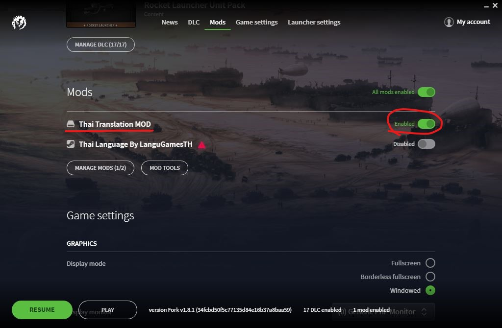

# ติดตั้งด้วยตนเองไม่ผ่าน Steam Workshop (Windows)

1. ถ้ายัง Subscribe ม็อดตัวนี้อยู่ให้กด Unsubscribe ม็อดใน Steam Workshop ก่อน
2. เข้าไปโหลดโค้ดได้ที่ https://github.com/pongmadee/HOI4-Thai-Translation-MOD/releases
3. ลบโฟลเดอร์ "C:\Users\\{ชื่อผู้ใช้}\Documents\Paradox Interactive\Hearts of Iron IV\mod"
4. ลบไฟล์ "C:\Users\\{ชื่อผู้ใช้}\Documents\Paradox Interactive\Hearts of Iron IV\mods_registry.json" (ถ้ามี)
5. แตกไฟล์ที่โหลดมาจากข้อ 2 จะมีโฟลเดอร์ที่มีชื่อว่า 'mod' ให้นำโฟลเดอร์ดังกล่าวไปไว้ที่   "C:\Users\\{ชื่อผู้ใช้}\Documents\Paradox Interactive\Hearts of Iron IV\"
6. เข้าเกม Launcher จะมองเห็นในส่วนของม็อด
7. เปิดใช้งานม็อด
8. กดปุ่ม Play

